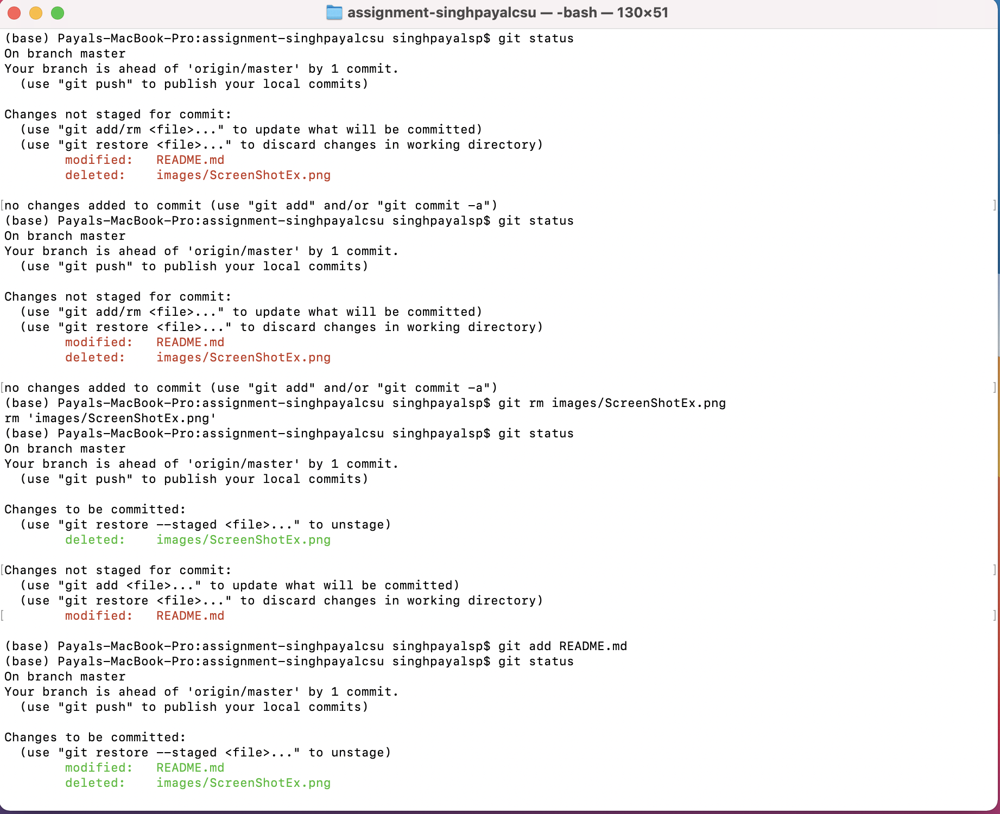
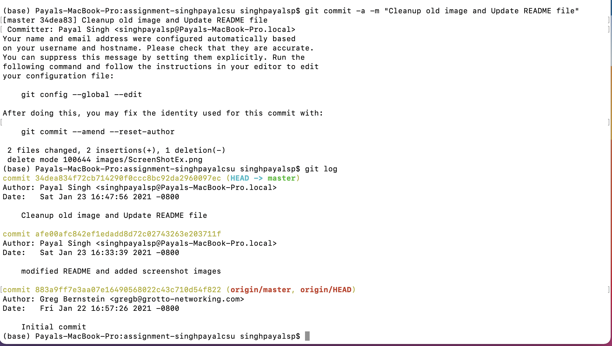

**Student Name**:  Payal Singh

**NetID**:  

# Homework #1 Solutions

## Question 1 

### 1(a)

### 1(b)

## Question 2 

### 2(a)

**Payal Singh**

**NetID:**

# Homework #1 Solution

## Question 1

## Question 2

### 2(b)

